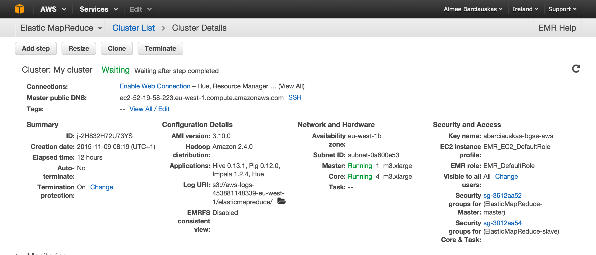

# Database Design

## Description

The GDELT Project collects and stores events gathered from many different news media, including broadcast, web and print. It identifies attributes of the event, such as actors, locations and significance and categorizes each into an event hierarchy.

The event hierachy is as follows:

[ADD ME]

In order to understand the spatial-temporal relationship of conflict events in the United States from April 2013 until the recent past, the application will be built on a subset of the GDELT database. The data is subset based on the following criteria:

* **Events ocurring on or after 1 April 2013:** We exclude any events ocurring before April 2013 for two important reasons. The first is this is when data collection by GDELT started and all events prior have been back-filled. Second, there is no SOURCEURL field. The SOURCEURL field is an important field for sanity-checking the original source of events.
* **Events within the United States:** We are limiting the scope of our analysis to events ocurring within the United States (e.g. Actor1Geo_Country or Actor2Geo_Country = 'US').
* **Events with a QuadClass of 3 or 4:** The QuadClass field is the highest level of the event type hierarchy and includes only the values 1=Verbal Cooperation, 2=Material Cooperation, 3=Verbal Conflict, 4=Material Conflict.
* **Events which meet a basic criterium of significance:** Given the comprehensivity of the GDELT algorithm, many events identified are trivial [GIVE EXAMPLES]. Fortunately, GDELT has given us a couple of fields we use to control for this, and we exclude all events not meeting our basic criterium of significance as being: [ADD ME]. This was decided by [ADD ME]

After subsetting the table, additional steps are required to build the conflict analysis database. These are described below in [Database Scripts](#database-scripts)

To be able to estimate the geo-spatial effects, the following data model is used:

## Database Scripts

The process for building the conflict analysis database is as follows:

#### 1. Data Import

1. imported data into RDS since April 2013 using [`scripts/importGdeltData.R`](./scripts/importGdeltData.R)
2. started emr cluster with 4 data nodes 
3. sqooped data into hdfs [`scripts/shell/sqoop-import.sh`](./scripts/shell/sqoop-import.sh)
4. built events table using impalal [`scripts/sql/impala-queries.sql`](./scripts/sql/impala-queries.sql)
5. subset events in the US (see impala queries script)
6. subset events in the US into random subset of a workable size
7. exported tables resulting from 5 and 6 back into RDS (see sqoop script)

#### 2. Create and join events with GNIS features (cities)

1. Download [GNIS features file](http://geonames.usgs.gov/docs/stategaz/NationalFile_20151001.zip)
2. Create the `gnis_features` table using [`scripts/sql/create_gnis_features.sql`](./scripts/sql/create_gnis_features.sql)
3. Import the data [`scripts/sql/create_gnis_features.sql`](./scripts/sql/create_gnis_features.sql)
4. Subset the features to only those of type 'populated place' (e.g. cities) and create the `events_with_cities` table [scripts/sql/events_features_joined_view.sql](./scripts/sql/events_features_joined_view.sql)

#### 3. Create aggregatetes table

1. Create the table [scripts/sql/conflict_events_city_day_counts.sql](./scripts/sql/conflict_events_city_day_counts.sql)
2. Join with self to add columns for lagged values of self and other cities [TODO]
3. Add city-characteristic and time-characteristic columns [TODO]

#### 4. Final script

The final dump file of the `conflict_events_city_day_counts` table will be used in the application.

[ADD HERE]
